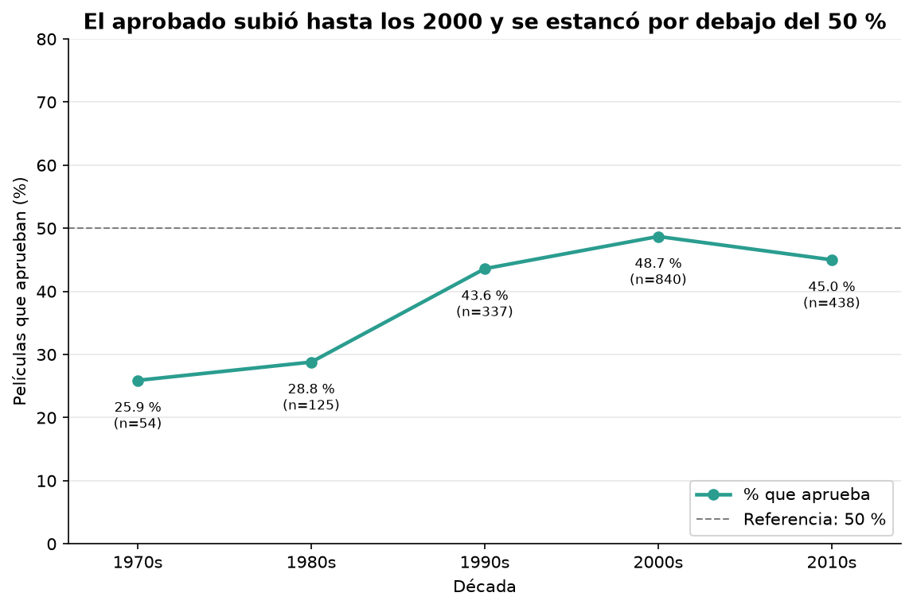
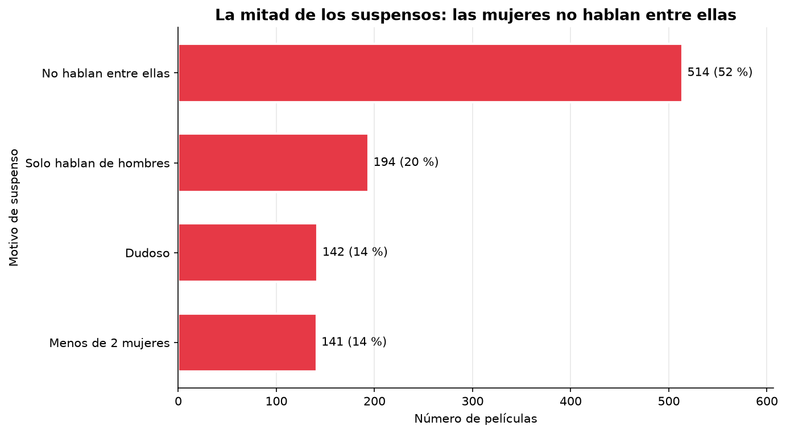
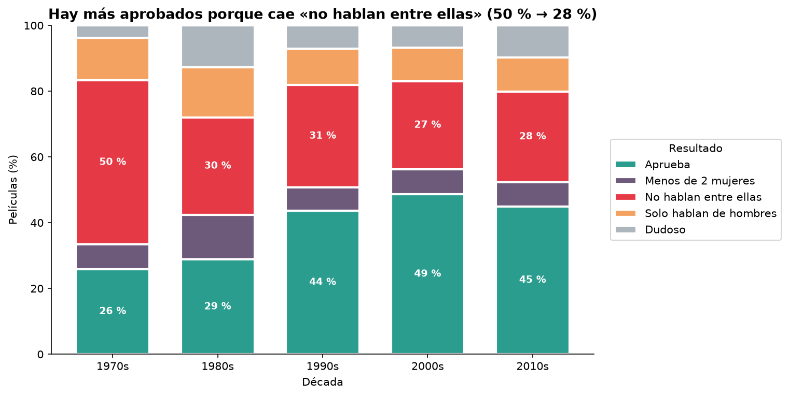
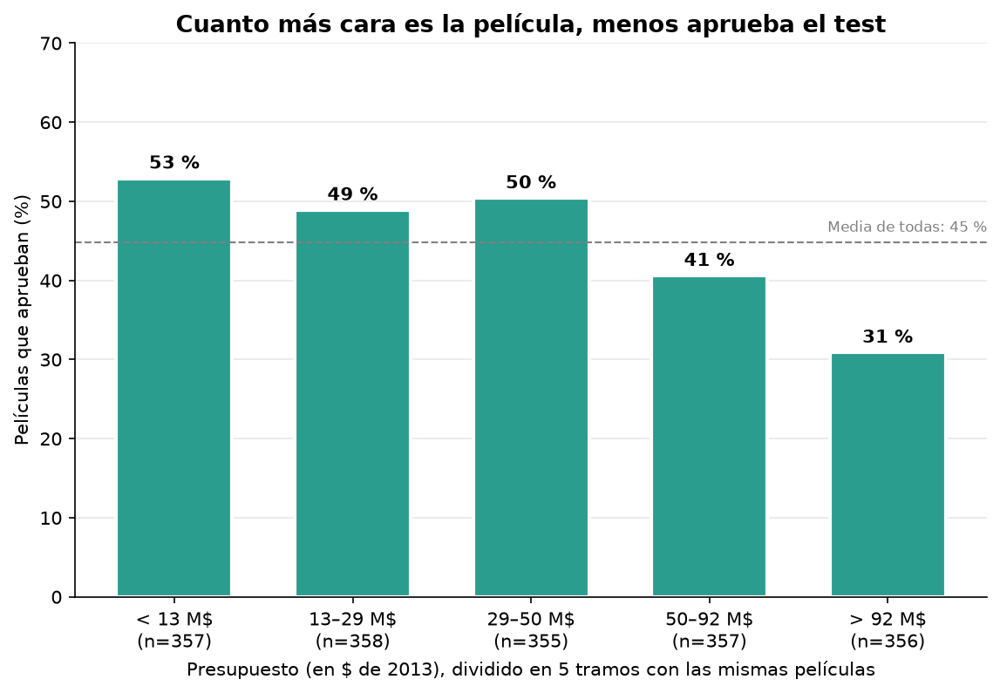
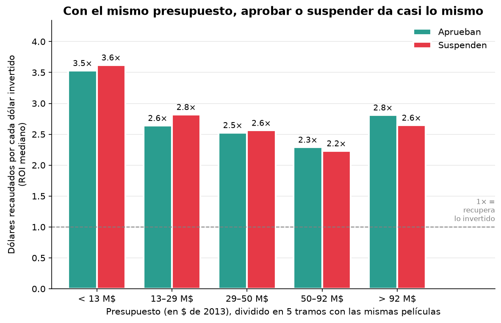
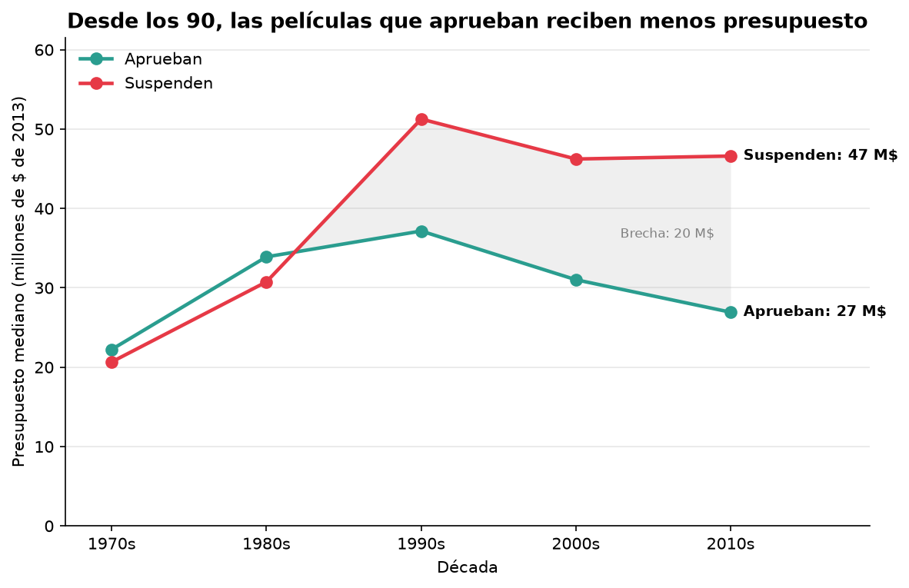
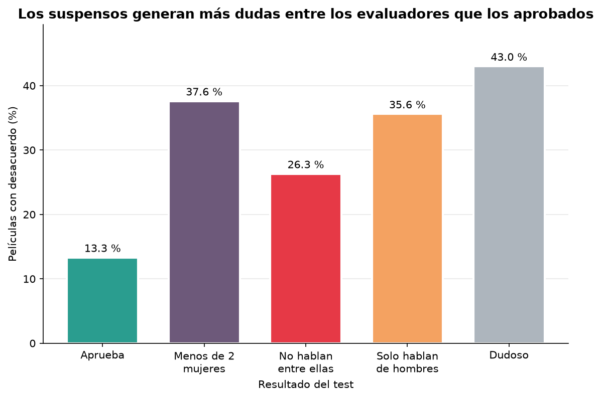

# Resultados: el test de Bechdel en 1.794 películas (1970–2013)

> **El test de Bechdel** pide tres cosas a una película: que salgan **al menos dos mujeres** con nombre, que **hablen entre ellas** y que hablen de **algo que no sea un hombre**.

## Resumen en 30 segundos

| # | Conclusión | Dato clave |
|---|---|---|
| 1 | **Menos de la mitad de las películas aprueba.** | 803 de 1.794 → **44,8 %** |
| 2 | **Se mejoró hasta los 2000 y después se estancó.** | 26 % en los 70 → 49 % en los 2000 → 45 % en los 2010 |
| 3 | **El gran obstáculo es que las mujeres no hablen entre ellas.** | Es el motivo de **1 de cada 2 suspensos** (52 %) |
| 4 | **Cuanto más cara es la película, menos aprueba.** | 53 % en las más baratas → **31 %** en las más caras |
| 5 | **Pero aprobar no hace la película menos rentable.** | En cada tramo de presupuesto, el ROI de las que aprueban y las que suspenden es casi igual |
| 6 | **Desde los 90 se invierte menos en las películas que aprueban.** | Década de 2010: **27 M$** frente a **47 M$** de mediana |

**La idea principal:** la industria pone menos dinero en las películas que aprueban el test, aunque los datos dicen que rinden lo mismo por cada dólar invertido.

---

## 1. ¿Ha mejorado con el tiempo?

**Cómo leerlo:** cada punto es el % de películas de esa década que aprueban; `n` es cuántas películas hay. La línea discontinua marca el 50 %.

**Conclusión:** el aprobado casi se duplica entre los 70 (26 %) y los 2000 (49 %), pero en los 2010 baja al 45 %. **Nunca llega al 50 %**: en ninguna década aprueba la mitad de las películas.

> ⚠️ Los 70 solo tienen 54 películas, así que su porcentaje es menos fiable que el de las décadas siguientes.

---

## 2. ¿Por qué suspenden?

**Cómo leerlo:** de las 991 películas que suspenden, cuántas lo hacen por cada motivo, ordenadas de mayor a menor.

**Conclusión:** el problema casi nunca es que no haya mujeres (14 %). Lo más habitual es que **sí hay al menos dos, pero no hablan entre ellas** (52 %). Es decir, aparecen, pero no tienen escenas propias.

---

## 3. ¿Qué ha cambiado en cada década?

**Cómo leerlo:** cada barra es una década y suma 100 %. Cada color es un resultado del test.

**Conclusión:** la subida del aprobado (verde) se explica casi entera por la **caída del rojo, «no hablan entre ellas»**, que pasa del 50 % en los 70 al 27–31 % desde los 80. El resto de motivos se mantiene bastante estable.

---

## 4. ¿Influye el presupuesto en aprobar?

**Cómo leerlo:** se ordenan las películas por presupuesto (en dólares de 2013, para poder comparar años distintos) y se dividen en **5 grupos con el mismo número de películas**. Cada barra es el % que aprueba en ese grupo.

**Conclusión:** hasta los 50 M$ aprueba la mitad de las películas, pero **a partir de ahí el aprobado cae**: en las superproducciones de más de 92 M$ solo aprueba el **31 %**. Cuanto más dinero hay en juego, menos protagonismo tienen las mujeres.

---

## 5. ¿Son menos rentables las películas que aprueban?

**Qué es el ROI:** recaudación mundial ÷ presupuesto. Un ROI de **3×** significa que la película **recaudó 3 $ por cada 1 $ que costó**. Por debajo de 1× pierde dinero.

**Cómo leerlo:** en cada tramo de presupuesto hay dos barras: las películas que aprueban (verde) y las que suspenden (rojo). Usamos la **mediana** (la película del medio) en lugar de la media, porque unos pocos éxitos enormes (ROI de más de 100×) disparan la media y no representan a la película típica.

**Por qué comparamos dentro de cada tramo:** si comparamos todas a la vez, mezclamos películas baratas con superproducciones, y como las que aprueban suelen ser más baratas, la comparación sería injusta. Dentro de un mismo tramo, las películas son comparables.

**Conclusión:** en **todos los tramos las dos barras son casi iguales** (la diferencia nunca pasa de 0,2×). Aprobar el test **no hace que una película sea menos rentable**. Además, en conjunto, el **81 %** de las películas recupera lo invertido, tanto si aprueban como si suspenden.

---

## 6. ¿Se invierte lo mismo en unas y otras?

**Cómo leerlo:** presupuesto mediano (en millones de dólares de 2013) de las que aprueban y de las que suspenden, década a década. La zona gris es la diferencia entre ambas.

**Conclusión:** en los 70 y los 80 las dos líneas van juntas. **A partir de los 90 se separan**: las películas que suspenden reciben cada vez más dinero y las que aprueban, menos. En los 2010 la brecha es de **20 M$** (27 M$ frente a 47 M$).

Junto con el gráfico 5, esto es lo más interesante del análisis: **se invierte menos en las películas que aprueban aunque son igual de rentables.**

---

## 7. ¿Están de acuerdo los evaluadores?

**Cómo leerlo:** % de películas de cada resultado en las que algún evaluador de la web *bechdeltest.com* no estaba de acuerdo con la nota.

**Conclusión:** cuando una película aprueba hay poco debate (13 %). Los suspensos generan mucha más discusión (26–43 %), sobre todo los marcados como «dudoso» (43 %). Esto indica que **los aprobados son más fiables** que los suspensos.

---

## Tabla de cifras

| | Aprueban | Suspenden |
|---|---:|---:|
| Películas (con datos económicos) | 798 | 985 |
| Presupuesto mediano | 31,7 M$ | 44,9 M$ |
| Recaudación mundial mediana | 80,9 M$ | 109,9 M$ |
| ROI mediano | **2,70×** | **2,60×** |
| % que recupera lo invertido (ROI > 1) | 81 % | 81 % |

Las que suspenden recaudan más en total **porque cuestan más**, no porque sean mejores negocio: por cada dólar invertido devuelven lo mismo, o incluso algo menos.

---

## Limitaciones (para no sacar conclusiones de más)

- **Correlación no es causa.** Que las películas caras aprueben menos no prueba que el presupuesto *cause* el suspenso. Puede haber otros factores, como el género: las películas de acción y de superhéroes son caras y suelen tener repartos mayoritariamente masculinos.
- **La muestra no es aleatoria.** Las películas vienen de *bechdeltest.com*, donde los usuarios eligen qué evaluar. Hay más películas conocidas y de EE. UU., y muy pocas de los 70.
- **El ROI es aproximado.** No incluye los gastos de publicidad ni los ingresos por DVD, *streaming* o televisión.
- **El test es muy básico.** Aprobar no significa que una película trate bien a sus personajes femeninos: solo mide unos mínimos.

---

## Cómo se ha calculado

Todo sale de ejecutar `python main.py`, que pasa los datos por las cuatro estaciones del pipeline:

1. **Cargar y validar** (`bechdel/carga.py`): comprueba columnas, valores y años.
2. **Limpiar** (`bechdel/limpieza.py`): corrige títulos, quita columnas sobrantes y calcula el ROI → `resultados/peliculas_limpio.csv`.
3. **Analizar** (`bechdel/analisis.py`): un método de `AnalizadorBechdel` por pregunta. Los cortes de presupuesto se hacen por cuantiles (`pd.qcut`), así que todos los tramos tienen unas 357 películas.
4. **Dibujar** (`bechdel/visualizacion.py`): cada gráfico es una clase hija de `GraficoBechdel` y se guarda en `resultados/graficos/`.

Todas las cantidades de dinero están en **dólares de 2013** (ajustadas por inflación), así que se pueden comparar películas de distintas décadas.
